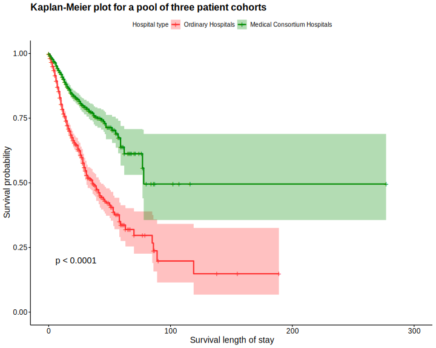
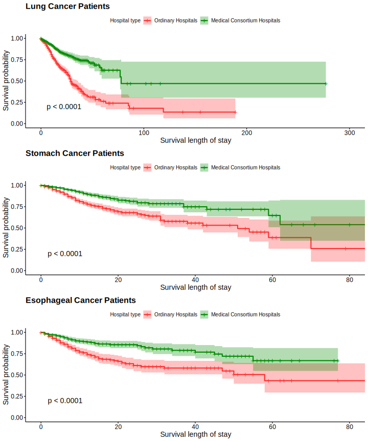

```{r setup, include=FALSE}
knitr::opts_chunk$set(echo = TRUE, message = F, warning = F, fig.width=8)
```

Kaplan-Meier plot is the most commonly used plot in survival data analysis. This tutorial shows how to make and customize Kaplan-Meier plot using the R package [survminer](https://github.com/kassambara/survminer).


# A single Kaplan-Meier plot

```{r newplotting}
load("m.feiai.Rdata")
load("m.shiguanai.Rdata")
load("m.weiai.Rdata")


library(survival)
require(survminer)
require(plyr)

total <- rbind(m.feiai, m.shiguanai, m.weiai)

total$integ <- plyr::revalue(factor(total$integ),c("0"="Ordinary Hospitals", "1"="Medical consortium Hospitals"))
utotalPSM <- Surv(total$p27, total$recovery)

ggsurvplot(survfit(utotalPSM ~ integ, data = total),   
   pval = TRUE,             
   conf.int = TRUE,
   legend.title = "Hospital type",
   legend.labs = c("Ordinary Hospitals", "Medical Consortium Hospitals"),
   submain  = "Kaplan-Meier plot for a pool of three patient cohorts",
   xlab = "Survival length of stay",
   palette = c("firebrick1", "green4"),
   font.submain = c(16, "bold"))

ggsave(file = 'plot_pool.svg', width = 10, height = 8)
```

Note that `ggsave()` from `ggplot2` package cannot save objects produced by `ggsurvplot()`. Therefore, you have to plot it and then save it. For journal publications, I advice that you use the following vector files, which never get pixelated and are able to be scaled to any size.

- `.svg`
- `.eps`
- `.pdf`

However, these vector graphs are not supported in Microsoft Word. LaTex supports these vector graphs.

After you save the Kaplan-Meier plot generated by the `ggsurvplot()` function, you can then include it using `knitr::include_graphics()`, as I demonstrate below.

```{r plot_pool}

```


# Multiple Kaplan-Meier plots on one single graph

```{r threecohorts, fig.height=12}
#1 Lung cancer plotting
m.feiai$integ <- revalue(factor(m.feiai$integ),c("0"="Ordinary Hospitals", "1"="Medical consortium Hospitals"))
uFeiaiPSM <- Surv(m.feiai$p27, m.feiai$recovery)
ggfei.m <- ggsurvplot(
  survfit(uFeiaiPSM ~ integ, data = m.feiai), 
   pval = TRUE,             
   conf.int = TRUE,
   legend.title = "Hospital type",
   legend.labs = c("Ordinary Hospitals", "Medical Consortium Hospitals"),
   submain  = "Lung Cancer Patients",
   xlab = "Survival length of stay",
   palette = c("firebrick1", "green4"),
   font.submain = c(16, "bold"))
  

#2 Stomach Cancer plotting
m.weiai$integ <- revalue(
  factor(m.weiai$integ),
  c("0"="Ordinary Hospitals", 
    "1"="Medical consortium Hospitals")
  )
uWeiaiPSM <- Surv(m.weiai$p27, m.weiai$recovery)
ggwei.m <- ggsurvplot(
  survfit(uWeiaiPSM ~ integ, data = m.weiai), 
   pval = TRUE,             
   conf.int = TRUE,
   legend.title = "Hospital type",
   legend.labs = c("Ordinary Hospitals", "Medical Consortium Hospitals"),
   submain  = "Stomach Cancer Patients",
   xlab = "Survival length of stay",
   palette = c("firebrick1", "green4"),
   font.submain = c(16, "bold"))


#3 Esophageal Cancer plotting
m.shiguanai$integ <- revalue(
  factor(m.shiguanai$integ),
  c("0" = "Ordinary Hospitals", 
    "1" = "Medical consortium Hospitals")
)
uShiguanaiPSM <- Surv(m.shiguanai$p27, m.shiguanai$recovery)
ggshiguan.m <-
  ggsurvplot(
    survfit(uShiguanaiPSM ~ integ, data = m.shiguanai),
    pval = TRUE,
    conf.int = TRUE,
    legend.title = "Hospital type",
    legend.labs = c("Ordinary Hospitals", "Medical Consortium Hospitals"),
    submain  = "Esophageal Cancer Patients",
    xlab = "Survival length of stay",
    palette = c("firebrick1", "green4"),
    font.submain = c(16, "bold")
  )


plot3cohorts = arrange_ggsurvplots(
  list(ggfei.m, ggwei.m, ggshiguan.m), 
  nrow = 3,
  ncol = 1)
```

Notice that you should specify `ncol = 1` since the default is `ncol = 2`. Otherwise you will get a significant wide space on the right side of your figure.

```{r saveplot3cohorts}
ggsave(file = 'plot3cohorts.svg', 
       plot3cohorts, 
       width = 10, height = 12)
```


You can use `arrange_ggsurvplots()` from `survminer` package to add several Kaplan-Meier plots onto one figure, as I showed above. You don't have to print the plots and then save them. Here I save all these graphs as objects in the R environment and save the final integrated graph to my local disk.

Them I can include this figure in my document:

```{r plot3cohorts}

```

