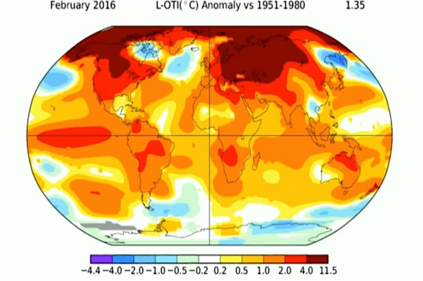
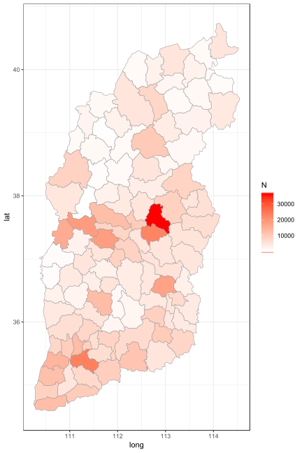

```{r setup, echo = FALSE}
options(echo = FALSE, fig.width = 12, cache = TRUE)
```

<style>

.center2 {
  margin: 0;
  position: absolute;
  top: 50%;
  left: 50%;
  -ms-transform: translate(-50%, -50%);
  transform: translate(-50%, -50%);
}

</style>

# Background

Climate change has been a global public health issue that has wide impacts on the society:

- human health, 
- agriculture, 
- food security,
- water supply


.pull-left[]
.pull-right[]

---
# Shanxi weather data

All the historical temperature data were scraped from [2345 Historical Weather](http://tianqi.2345.com/wea_history/53772.htm), published by [China Meteorological Administration](http://www.cma.gov.cn/en2014/).

* year 2013 to 2017
* 127 counties, 11 cities
* a wide range in latitude and complex and different types of landforms
  + distinct four seasons
  + different temperature patterns between north and south Shanxi
  + different temperature patterns between winter and summer
  + different temperature patterns between day and night
---
# Shiny app

.center2.font150[
  Two major components:
  
  1. Temperature trends
  2. Temperature variation trends
]

The link to the shiny app: [https://miaocai.shinyapps.io/datavisproject/](https://miaocai.shinyapps.io/datavisproject/)

---
# Temperature trends

It shows temperature trends on any selected periods between January 1, 2013 and November 28, 2017 in any of the 127 counties in Shanxi, China.

.pull-left[
Choices:

- **City**: 11 cities
- **County**: 127 counties in total
- **Time range**: between January 1, 2013 and November 28, 2017
- **Temperature types**: Maximum, Average, Minumum
]

.pull-right[

]

---
# Example

.center2[
```{r trend, message =F, echo=F,fig.width=11, fig.height=6, fig.align='center'}
require(tidyverse)
require(xts)
require(dygraphs)

load("manual_data.Rdata")

manual_data %>%
      select(tmax, tmed, tmin) %>%
      xts(., order.by = manual_data$date) %>%
      dygraph(main = "Temperature trend in Datong County, 
              Datong City, Shanxi China",
              y = "Temperature in Fahrenheits") %>%
      dyAxis("x", drawGrid = FALSE) %>%
      dyOptions() %>%
      dyLegend(width = 400) %>% 
  dyRangeSelector()
```
]

---
# Temperature variation
## Sources:

- Horizontal variation ( $V_h$ ): the sum of the absolute difference between the average temperature in two consecutive days in the past week. 
- Vertical variation ( $V_v$ , a.k.a. diurnal range): the absolute difference between the maximum and minimum temperature during a day.


$$V_h = \sum_{i = \text{d} - 7}^{\text{d}} \Big|T_i - T_{i - 1}\Big|$$

Where $d$ is today's date.

$$V_v = T_{max} - T_{min}$$

This decomposition allows for temperature variation within a day and temperature variation across multiple days.

---
# Example

.center2[
```{r variation, echo=F,fig.width=11, fig.height=6, fig.align='center'}
manual_data %>%
      select(tvarv, tvarh) %>%
      xts(., order.by = manual_data$date) %>%
      dygraph(main = "Temperature variation in Datong County, 
              Datong City, Shanxi China",
              y = "Temperature in Fahrenheits") %>%
      dySeries("tvarv", label = "Vertical variation", color = "orange") %>%
      dySeries("tvarh", label = "Horizontal variation", color = "green") %>%
      dyOptions() %>%
      dyAxis("x", drawGrid = FALSE) %>%
      dyLegend(width = 400) %>%
      dyRangeSelector()
```
]

---

.center2.font200[
**Q & A**
]

